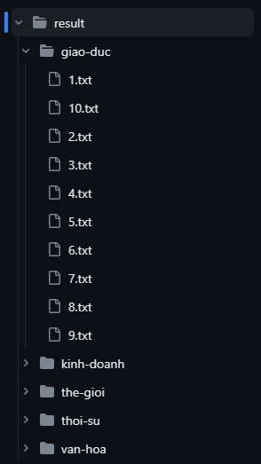

# VN_NewsCrawler (2023)

**VN_NewsCrawler** is a Python-based web scraping tool designed to extract articles from [VietNamNet](https://vietnamnet.vn/) and organize them in an efficient manner. This project is intended for educational purposes and serves as a practical example of how to scrape news articles from a website, categorize them, and save the content to separate text files.

## Installation

**VN_NewsCrawler** requires Python 3.8 or higher and the following Python packages:

- [BeautifulSoup](https://pypi.org/project/beautifulsoup4/)
- [Requests](https://pypi.org/project/requests/)
- [TQDM](https://pypi.org/project/tqdm/)

Follow these steps to set up the project:

1. Clone this repository:

   ```bash
   $ git clone https://github.com/ptthanh02/VN_NewsCrawler.git
   ```

2. Navigate to the project directory:

   ```bash
   $ cd VN_NewsCrawler
   ```

3. Create and activate a virtual environment (recommended):

   ```bash
   $ python -m venv venv
   $ venv\Scripts\activate
   ```

4. Install the required packages:

   ```bash
   $ pip install -r requirements.txt
   ```

## Configuration

You can customize the crawling process by modifying the configuration file `config.py`. Adjust the following parameters to suit your needs:

```python
categories = ['thoi-su', 'kinh-doanh', 'van-hoa', 'giao-duc', 'the-gioi'] 
number_of_articles = 10  # Number of articles to crawl for each category
```

By default, the configuration will crawl 10 articles for each category listed in the `categories` variable, resulting in a total of 50 crawled articles. You can change the `number_of_articles` to scrape more articles or modify the `categories` variable to target specific categories.

#### Supported categories:
| **Categories**  | **Categories' Names**        |
| ----------- | ----------- |
| 'chinh-tri' | Chính Trị   |
| 'thoi-su'   | Thời Sự     |
| 'kinh-doanh'| Kinh Doanh  |
| 'van-hoa'   | Văn Hóa     |
| 'giao-duc'  | Giáo Dục    |
| 'the-gioi'  | Thế Giới    |
| 'the-thao'  | Thể Thao    |
| 'giai-tri'   | Giải Trí    |
| 'doi-song'  | Đời Sống    |
| 'suc-khoe'  | Sức Khỏe    |
| 'thong-tin-truyen-thong' | Thông Tin Truyền Thông |

## Usage

To start the web scraping process, simply run the crawler with the following command:

```bash
$ python crawl.py
```

## Results

The **VN_NewsCrawler** will automatically create a `result` folder and store the crawled articles in the following organized structure:



- The `result` folder contains subdirectories for each news category.
- Each category folder stores articles related to that specific category.
- Each article is saved as an individual `.txt` file within its respective category folder.
- The articles are uniquely named to prevent overwriting existing content.

This structure ensures that the scraped articles are neatly organized and easily accessible, making it simple to locate and utilize the extracted information. Check the `result` folder for a [full example](https://github.com/ptthanh02/VN_NewsCrawler/tree/main/result).

## Completed Code Available

If you prefer to work with Notebook, you can find [the crawler](https://github.com/ptthanh02/VN_NewsCrawler/blob/main/completed_code/crawler_full.ipynb) in the `completed_code` folder. This allows you to further customize the crawler to your specific requirements.

Enjoy using **VN_NewsCrawler** for your web scraping needs, and feel free to contribute to the project's development. Happy scraping!


<h3>
<details>
  <summary>👇 Tiếng Việt </summary>
  <hr>
</h3>  
# VN_NewsCrawler (2023)

**VN_NewsCrawler** là một công cụ cào dữ liệu dựa trên Python được thiết kế để trích xuất bài báo từ web [VietNamNet](https://vietnamnet.vn/) và tổ chức chúng một cách hiệu quả. Dự án này được thiết kế cho mục đích giáo dục và là một ví dụ thực tế về cách lấy dữ liệu từ các bài báo trên một trang web, phân loại chúng và lưu nội dung vào các tệp văn bản riêng biệt.

## Cài Đặt

**VN_NewsCrawler** yêu cầu Python phiên bản 3.8 trở lên và các gói Python sau:

- [BeautifulSoup](https://pypi.org/project/beautifulsoup4/)
- [Requests](https://pypi.org/project/requests/)
- [TQDM](https://pypi.org/project/tqdm/)

Làm theo các bước sau để thiết lập dự án:

1. Sao chép dự án này:

   ```bash
   $ git clone https://github.com/ptthanh02/VN_NewsCrawler.git
   ```

2. Di chuyển đến thư mục dự án:

   ```bash
   $ cd VN_NewsCrawler
   ```

3. Tạo và kích hoạt môi trường ảo (được khuyến nghị):

   ```bash
   $ python -m venv venv
   $ venv\Scripts\activate
   ```

4. Cài đặt các gói cần thiết:

   ```bash
   $ pip install -r requirements.txt
   ```

## Cấu Hình

Bạn có thể tùy chỉnh quá trình lấy dữ liệu bằng cách sửa tệp cấu hình `config.py`. Điều chỉnh các thông số sau để phù hợp với nhu cầu của bạn:

```python
categories = ['thoi-su', 'kinh-doanh', 'van-hoa', 'giao-duc', 'the-gioi']
number_of_articles = 10  # Số bài báo để lấy dữ liệu cho mỗi danh mục
```

Mặc định, cấu hình sẽ lấy 10 bài báo cho mỗi danh mục được liệt kê trong biến `categories`. Tổng số bài báo lấy được là 50. Nếu bạn muốn lấy nhiều bài báo hơn, bạn có thể thay đổi giá trị của biến `number_of_articles`. Nếu bạn muốn chỉ lấy dữ liệu từ các danh mục cụ thể, bạn có thể sửa biến `categories`.

#### Các danh mục được hỗ trợ:
| **Danh Mục**  | **Tên Danh Mục**        |
| ----------- | ----------- |
| 'chinh-tri' | Chính Trị   |
| 'thoi-su'   | Thời Sự     |
| 'kinh-doanh'| Kinh Doanh  |
| 'van-hoa'   | Văn Hóa     |
| 'giao-duc'  | Giáo Dục    |
| 'the-gioi'  | Thế Giới    |
| 'the-thao'  | Thể Thao    |
| 'giai-tri'   | Giải Trí    |
| 'doi-song'  | Đời Sống    |
| 'suc-khoe'  | Sức Khỏe    |
| 'thong-tin-truyen-thong' | Thông Tin Truyền Thông |

## Sử Dụng

Để khởi động quá trình cào dữ liệu trang web, bạn chỉ cần chạy lệnh sau:
```bash
$ python crawl.py
```

## Kết Quả

**VN_NewsCrawler** sẽ tạo ra một thư mục `result` và lưu trữ các bài báo đã lấy dữ liệu theo cấu trúc sau:


- Thư mục `result` bao gồm các thư mục con đặt tên tương ứng với các danh mục tin tức.
- Mỗi thư mục con chứa các bài báo thuộc danh mục đó.
- Mỗi bài báo được lưu dưới dạng một tệp `.txt` riêng biệt trong thư mục con của nó.
- Mỗi tệp `.txt` được đặt tên theo quy tắc sử dụng các số nguyên liên tiếp như `1.txt`, `2.txt`, `3.txt`,.. để tránh việc ghi đè nội dung đã có sẵn.

Cấu trúc này giúp cho việc sắp xếp và truy xuất các bài báo được lấy dữ liệu một cách dễ dàng và hiệu quả. Bạn có thể xem thư mục `result` để xem ví dụ [hoàn chỉnh](https://github.com/ptthanh02/VN_NewsCrawler/tree/main/result).

## Mã Nguồn Hoàn Chỉnh

Nếu bạn muốn dùng **VN_NewsCrawler** trên Notebook, bạn có thể lấy code hoàn chỉnh [tại đây](https://github.com/ptthanh02/VN_NewsCrawler/blob/main/completed_code/crawler_full.ipynb). Bạn có thể tùy biến crawler lấy dữ liệu theo nhu cầu riêng của mình.

Chúc bạn có những trải nghiệm cào dữ liệu thú vị!
</details>
